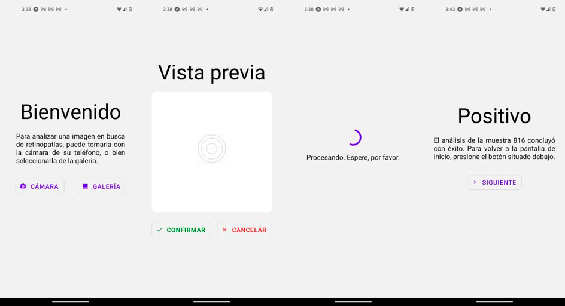

    

## Introduction

DED-AI is a full stack solution for the detection of diabetic retinopathy (DR), using machine learning. Its goal is to propose a faster, cheaper and effective alternative to existing solutions, which mostly rely in retinographs to take fundus images and qualified personnel to evaluate them.

Thanks to a React Native based app, users can take and send pictures to an API REST server, written in Express JS. This server manages authentication, and communications with a second Flask server, which invokes the ML model. Analysis related info is stored in a MongoDB cluster.

DED-AI has been developed as my Bachelor's Thesis, tutored by María Teresa García Ordás (University of León) and José Luis Vidal (HP SCDS).

## Structure

Parent directory contains three folders:

- [DED_AI_Client](https://github.com/jgomem04/DED_AI/tree/main/DED_AI_Client) includes all code for the mobile app.
- [DED_AI_Server](https://github.com/jgomem04/DED_AI/tree/main/DED_AI_Server), for API REST source files.
- [DED_AI_Model_Server](https://github.com/jgomem04/DED_AI/tree/main/DED_AI_Model_Server) contains the trained PyTorch model, as well as the Flask server files.

Each folder contains a README guide for setup.

## Model results

Current model achieves a global sensibility of 75.75%. Value increases for worse, grade 3 and 4 DRs (91.24% and 87.61% respectively), while for grade 1 and 2 sensibilities of 63.07% and 79.54% are achieved.

## More info

Complete thesis (in Spanish) can be found in [Docs](https://github.com/jgomem04/DED_AI/tree/main/Docs) folder.

More info about the problem is available in [HP SCDS website](https://hpscds.com/observatorio-tecnologico/observatorio-hp-22-23/#DED-AI).

## App screenshots

    

